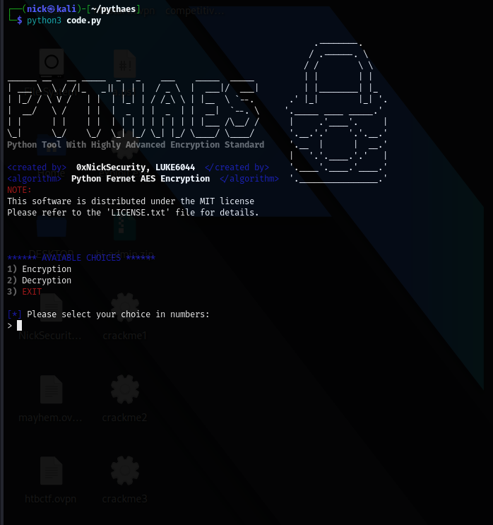

# 𝙋 𝙔 𝙏 𝙃 𝘼 𝙀 𝙎

[](LICENSE.txt)




## Table of Contents

- [Introduction](#introduction)
- [Features](#features)
- [Installation](#installation)
- [License](#license)
- [Contact](#contact)

## Introduction

This project is a simple encryption tool named "PYTHAES" (acronym for "PYThon Highly Advanced Encryption Standard") and offers various standard encryption features.
NOTE: the tool is still in beta version and new features will probably be released in the future.

## Features

### Encryption
- **Feature 1**: encrypt a phrase.
- **Feature 2**: encrypt a whole directory.
- **Feature 3**: encrypt a whole directory with his subdirectories.

### Decryption
- **Feature 4**: decrypt a phrase
- **Feature 5**: decrypt a whole directory
- **Feature 6**: decrypt a whole directory with his subdirectories.

## Installation

To install and set up this project, follow these steps:

1. Clone the repository:
    ```sh
    git clone https://github.com/0xNickSecurity/Pythaes.git
    ```
2. Navigate to the project directory:
    ```sh
    cd Pythaes
    ```
3. Install the necessary dependencies:
    ```sh
    pip install -r requirements.txt
    ```
4. Start the tool and encrypt the world:
    ```sh
    python3 pythaes.py
    ```
    
## License

This project is licensed under the MIT License. For more information, please refer to the [LICENSE.txt](LICENSE.txt) file.

## Contact

For any inquiries or questions, please contact us on telegram: %SystemRoot% and LukeSecurity.

